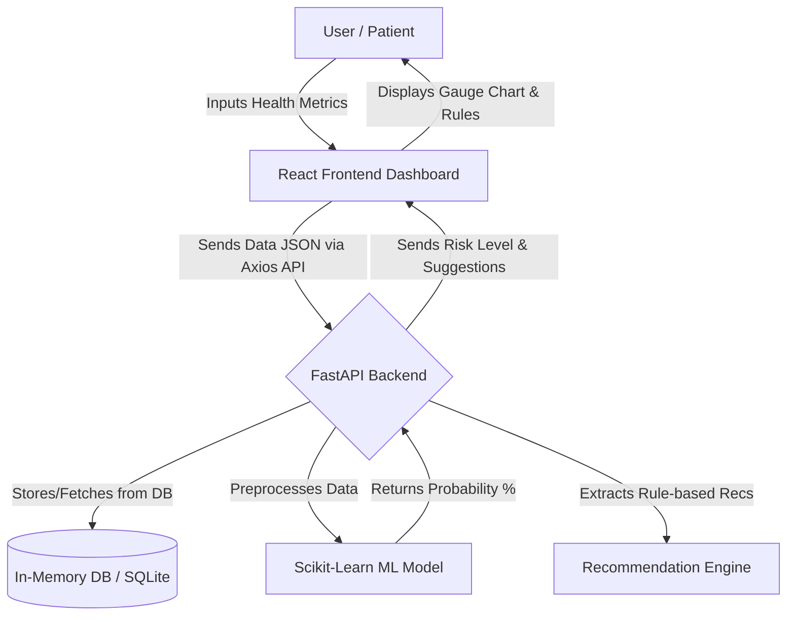

# CardioCare AI - Early Detection of Heart Attack using Machine Learning

## Overview
CardioCare AI is a full-stack web application that predicts the risk of heart attacks based on patient health metrics using a machine learning model. It features a modern, responsive React-based frontend styled with Tailwind CSS, a High-performance FastAPI backend, and a Random Forest ML model trained using Scikit-Learn.

## Project Architecture & Flowchart



## Machine Learning Model
The application uses a **RandomForestClassifier**. The model assesses standard fields based on the UCI Heart Disease dataset structure, including: `age`, `cholesterol`, `blood pressure`, `chest pain type`, `fasting blood sugar`, and `exercise induced angina`, complemented by variables to form robust user profiles (`BMI`, `smoking`, and `alcohol`). 

Random Forest is used because it inherently understands the complex interaction between physiological categories (like chest pain type) and continuous metrics (like cholesterol) without requiring excessive transformations, providing high-accuracy predictive capabilities through an ensemble of underlying decision trees to reduce variance.

## Recommendation Engine Logic
The system acts as a decision-support tool. Our backend utilizes rule-based expert logic independent of the ML probability to guarantee deterministic medical guidance based on thresholds:
1. **Smoking & Alcohol Base:** `IF smoking='yes' OR alcohol='yes' => "Quitting smoking and alcohol can reduce heart attack risk by up to 20%."`
2. **BMI Threshold:** `IF bmi > 25 (Overweight) => "Consider weight control and regular exercise to reduce BMI."`
3. **Blood Pressure:** `IF trestbps > 130 => "Your blood pressure is elevated. We suggest a low salt, dash-centered diet and clinical checkups."`
4. **Cholesterol Risk:** `IF chol > 200 => "Your cholesterol is elevated. Limit saturated fats and avoid oily or high-cholesterol food."`
5. **Diet Recommender:** Suggests fiber-rich diets rich in apples, bananas, and green vegetables universally.

## General Project Structure
- `backend/`: FastAPI application (`main.py`), PyJWT Auth, ML preprocessing logic.
- `frontend/`: React components, Pages (`Login`, `Signup`, `Dashboard`), Chart.js Integration, Tailwind UI styling.
- `ml/`: Model training scripts with data synthesis mimicking UCI features.

## Launch & Testing

### 1. Run the API (Backend)
```bash
cd backend
pip install -r requirements.txt
python -m uvicorn main:app --reload
```

### 2. Run the Interface (Frontend)
```bash
cd frontend
npm install
npm run dev
```

> **Important**: This tool provides probabilistic suggestions and acts primarily as an educational decision-support layer. It does not replace explicit diagnoses made by cardiologists or proper medical authority.
